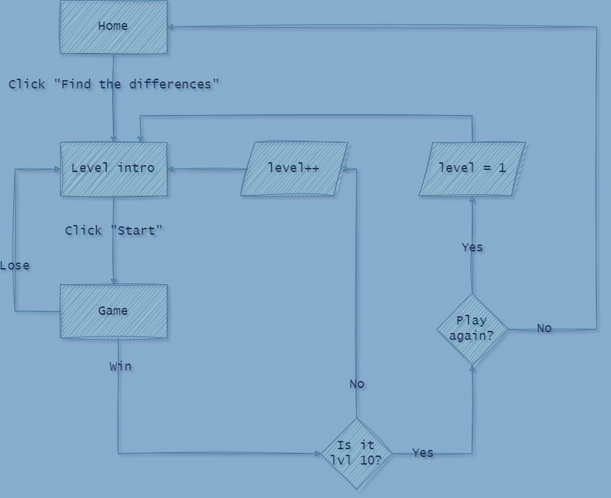
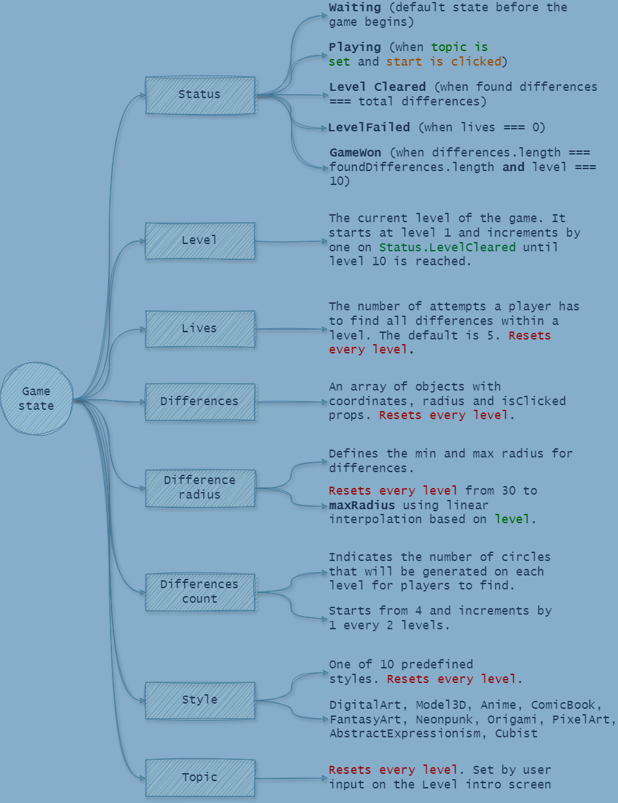

<p align="center">
  <a href="https://plaibox.onrender.com" target="_blank"></a>
</p>
<p align="center">
    <h1 align="center"><a href="https://plaibox.onrender.com" target="_blank">plAIbox</a></h1>
</p>
<p align="center">
	
	
	
<p>
<p align="center">
		<em>Developed with the software and tools below.</em>
</p>
<p align="center">
    
    
    
    
    
	
	
	
	
	
    
    
</p>
<hr>

## 🔗 Quick Links

> - [📍 Overview](#-overview)
> - [📦 Projects](#-projects)
> - [🚀 Getting Started](#-getting-started)
>   - [⚙️ Installation](#️-installation)
>   - [🤖 Running plAIbox](#-running-plAIbox)
>   - [🧪 Tests](#-tests)
>   - [🏗 Production build](#-production-build)
> - [📄 License](#-license)

---

## 📍 Overview

plAIbox is a playground for testing small projects.

---

## 📦 Projects

### Find the differences

#### Game about finding the differences in AI generated images.

Image generation logic:
1. Topic and style of the image is determined in the level intro.
2. An initial 1024x1024 image is generated using Stability AI API.
3. A mask is generated locally for every level - 1024x1024 white image with black circles. Circle positions are random. Circle count and radius range is determined by the difficulty and level progression.
3. The initially generated image and the mask are used for generating the second image.

#### Game flowchart


#### Game state


---

## 🚀 Getting Started

### ⚙️ Installation

```sh
npm install
```

### 🤖 Running plAIbox

Use the following command to run plAIbox:

```sh
npm start
```

Runs the app in the development mode.\
Open [http://localhost:3000](http://localhost:3000) to view it in the browser.

The page will reload if you make edits.\
You will also see any lint errors in the console.

### 🧪 Tests

To execute tests, run:

```sh
npm test
```

Launches the test runner in the interactive watch mode.

### 🏗 Production build

To create a production build, run:

```sh
npm run build
```

Builds the app for production to the `build` folder.\
It correctly bundles React in production mode and optimizes the build for the best performance.
The build is minified and the filenames include the hashes.

---

## 📄 License

This project is protected under the MIT License. For more details, refer to the [LICENSE](LICENSE) file.